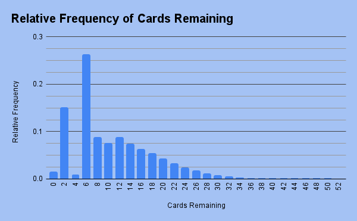

# SolitaireSim
Making a program to test the likely-hood of a winning solitaire deck in a certain kind of solitaire game

The game is deterministic. There is no player choice, so I wanted to find the likelihood of winning in the long term. This was a bit of a rough implementation of the games algorithm (I relied way too much on breaks and continues) but it's working. More than anything though, I wanted to do this to practice using python because all of my recent projects have been built in C++

The current program runs the simulation a number of times specified by the variable sim_runs. In order to keep track of output, I made a progress counter that outputs a message every 100th of the full simulation loop. This was because I ran the program for hours on end to run 17.5M trials, so I wanted something to make sure the test was stil running. The program also saves the configuration of the deck for the most remaining at a time. I did this to find possible configurations where you can have a perfect loss, where you can't get rid of a single card.

The rules of the solitaire game:
1. Shuffle a deck.
2. Draw until you have 4 cards.
3. The 1st and 4th cards in your hand will be compared. If they are both the same suit, remove the two cards between them. If they are both the same number, remove both the cards, and the two cards between them.
4. This process is repeated until you run out of cards to draw, always making sure you have at least 4 cards in your hand.
5. When you run out of cards in the deck, start cycling the back card of your hand to the front, and repeating step 3.
6. When you can no longer remove any cards, or you have removed every card from your hand, the game is over. The goal of the game is to run out of cards in your hand.

The common stats I found were:

Win Percentage: 1.45%

Avg. Remaining Cards: 10.55

Most Common Outcome: 6 Cards